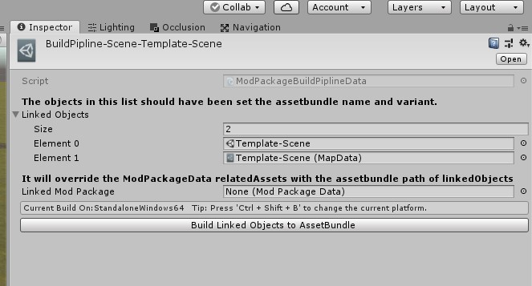

# Cry of War UGC - Map

This tutorial assumes that you know the basic knowledge of Unity. If you do not,you can find tutorials about Unity online.

## Preparation

First,you should prepare a map with navmesh in the Unity. A simple one like what is in the picture is also fine.

## Team Spawn

To spawn tanks,you should have gameobjects with Team tags. Create an empty gameobject and set its tag to TeamAStartPoint for TeamA and TeamBStartPoint for TeamB. And put serveral of them in the scene.

## WayPoint

To navigate the tanks,you should have gameobject with WayPoint tags. Create an empty gameobject and set its tag to WayPoint. And put serveral of them in the scene. The tanks will go to these way points.

## Label the scene

You need to set up the asset bundle label. Find your scene asset and you can set it in the bottom of the inspector.

## Create Map Data

Right click the project window and click MapData.

Fill the Map Name.(Corresponding to your scene name)
Add Support Modes.(Add infinite mode is fine for now)
Fill Scene Name. (Corresponding to your scene name)
Fill Asset Bundle Name. (Corresponding to what you have set in the process 'Label the scene')

And finally click the button at the bottom.

## Create Mod Package

Cick the button at the bottom to build assets.

A folder will pop-up and that is your final assets.

## Local Test

[Click to view Local Test](../LocalTest/LocalTest.md)
