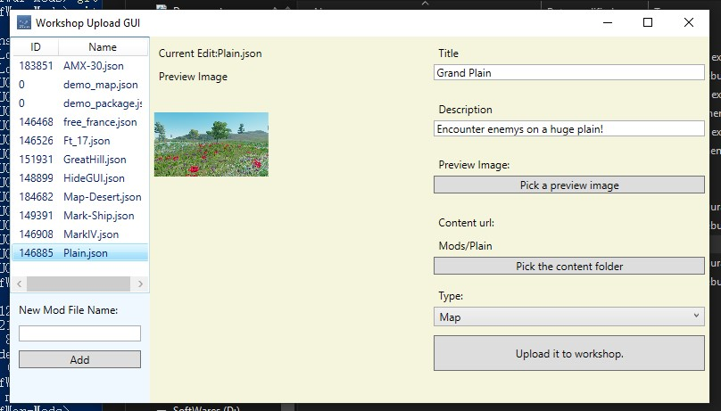

# Upload

Upload tool is located at the default game installation folder :
SteamLibrary/steamapps/common/Cry of War/Mod-Tools

/WorkshopGUI.exe is your uploading tool.

/Mods/ is the default folder for your to store uploading files.

First, open the WorkshopGUI.exe, and input your mod's name in the left corner and press Add button.

Then, input the title and description of your mod in the right side. Then make the preview image for your mod. (16:9 ratio is recommended) Also, the size of the preview image should smaller than 1mb, otherwise you will get an error when uploading.

After that, create a new folder under SteamLibrary/steamapps/common/Cry of War/ModTools/Mods/ and name it as your mod's name. Place your contents in your folder. Click upload it to workshop button. (Steam should be opened and login in)

You can set it public when it is ready in your steam workshop manage page.

<https://steamcommunity.com/id/${You-nick-name}/myworkshopfiles/?appid=798840>
